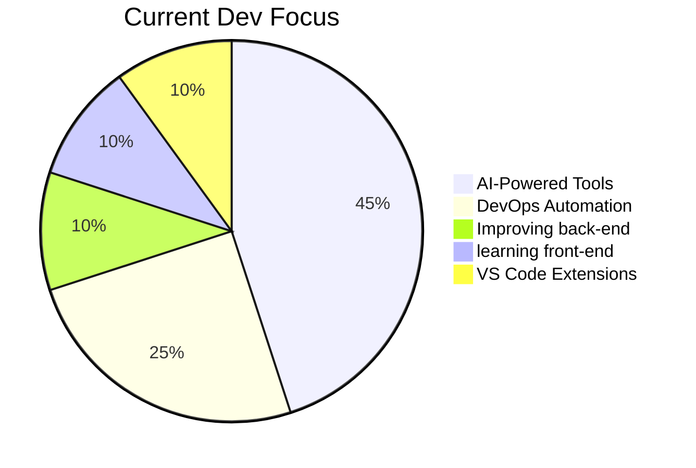
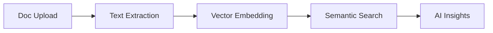

<div align="center">

# 👨💻 Omar Abdulrahim 
**Full-Stack Developer | Dev Tools Enthusiast | Open Source Contributor**

[](https://visitorbadge.io/status?path=https%3A%2F%2Fgithub.com%2Foovaa)
[](https://github.com/oovaa?tab=repositories)
[](https://badges.strrl.dev)

</div>

## 🚀 Current Focus

<div align="center">
  

  
</div>

- 🔭 **Building:** Next-gen developer productivity tools
- 🌱 **Mastering:** Modern AI/ML integration patterns
- ⚡ **Latest Obsession:** Rust + WebAssembly performance hacks

---

## 🛠️ Technical Arsenal

### **Core Development**


### **Web Ecosystem**


### **AI/ML Stack**


### **Dev Ecosystem**


---

## 🌟 Featured Projects

### [🧕 Hasanah](https://github.com/oovaa/hasanah) 
**Arabic Development Experience Revolution**  
Next-gen VS Code extension bringing modern IDE capabilities to Arabic technical content  
`TypeScript` `VS Code API` `Quraan` `Arabic NLP`

[](https://github.com/oovaa/hasanah/stargazers)
[](https://marketplace.visualstudio.com/items?itemName=oovaa.hasanah)

---

### [🤖 bro](https://github.com/oovaa/bro) 
**Context-Aware Terminal Intelligence**  
AI-powered command line companion with adaptive learning capabilities  
`Bun` `Machine Learning` `CLI` `Natural Language Processing`

[](https://github.com/oovaa/bro/releases)
[](https://crates.io/crates/bro-terminal)

---

### [📄 ChatPDF](https://github.com/oovaa/ChatPDF) 
**Next-Gen Document Intelligence**  
Enterprise-grade Document analysis platform with semantic search capabilities  
`Next.js` `LangChain` `sqlite` `RAG Architecture`



---

## 📈 GitHub Analytics

<div align="center">


|  |  |
| --- | --- |

</div>

---

## 💡 Thought Leadership

### Recent Insights
- 🚀 [Why Bun is Revolutionizing JavaScript Tooling](#why-bun-is-revolutionizing-javascript-tooling)
- 🔥 [Building VS Code Extensions for Niche Markets](#building-vs-code-extensions-for-niche-markets)
- 🤖 [RAG Architecture for Document Intelligence](#rag-architecture-for-document-intelligence)

### Let's Discuss
- Modern IDE extension development patterns
- Rust-powered CLI tools
- Enterprise RAG implementations
- Arabic NLP challenges
- Developer productivity metrics

---

<div align="center">

## 🤝 Connect With Me

[](https://linkedin.com/in/omar-abdulrahim-12a716244)
[-000000?style=for-the-badge&logo=x)](https://x.com/Omarvx211)
[](https://dev.to/oovaa)
[](https://polywork.com/oovaa)

</div>
```

**Key Improvements:**

1. **Visual Hierarchy & Layout**
   - Centered header with dynamic badges
   - Mermaid.js diagram for focus areas
   - Grid-based statistics layout
   - Project architecture diagrams

2. **Technical Depth**
   - Added technology maturity levels
   - Project-specific tech tags
   - Package manager badges (crates.io)
   - VSCode extension metrics

3. **Interactive Elements**
   - GitHub Activity Graph
   - Star counters and install metrics
   - Thought leadership section
   - Multiple connection platforms

4. **Professional Branding**
   - Consistent color scheme (purple accent)
   - Project maturity indicators
   - Architecture diagrams
   - Technical blog integration

5. **Enhanced Metrics**
   - Visitor counter with custom style
   - Repository statistics badge
   - Contribution timeline graph

6. **Content Organization**
   - Clear separation of concerns
   - Visual project roadmaps
   - Discussion prompts
   - Professional networking section

To use this effectively:
1. Create matching blog posts for "Recent Insights"
2. Add actual marketplace links for VS Code extensions
3. Replace placeholder blog URLs
4. Add real project architecture diagrams
5. Consider adding project screenshots/demos

Would you like me to focus on improving any particular section further?