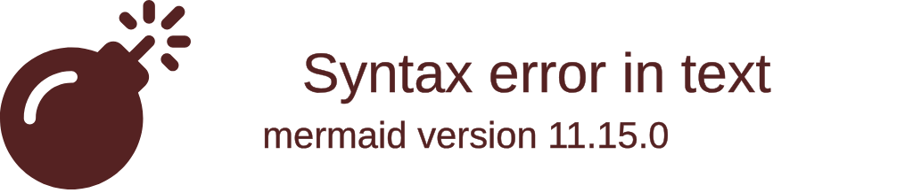
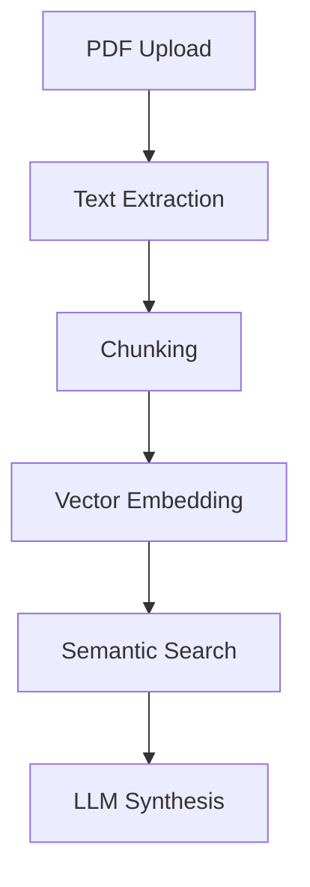

# 👨💻 Omar Abdulrahim 
**Full-Stack Developer | AI Tooling Specialist | Open Source Advocate**

## 🚀 Current Focus

  

  

- 🔭 **Building:** AI-enhanced development toolchain
- 🌱 **Mastering:** Distributed systems & RAG architectures
- ⚡ **Experimenting:** WebAssembly integration patterns

---

## 🛠️ Technical Arsenal

### **Core Development**

### **Web Architecture**

### **AI/ML Stack**

### **Dev Ecosystem**

---

## 🌟 Featured Projects

### [🧕 Hasanah](https://github.com/oovaa/hasanah) 
**Arabic Development Toolkit**  
VS Code extension revolutionizing Arabic technical documentation handling  
`TypeScript` `LSP` `Arabic NLP` `Quranic Analysis`

---

### [🤖 bro](https://github.com/oovaa/bro) 
**Intelligent Terminal Assistant**  
Context-aware CLI tool with machine learning capabilities  
`Rust` `MLOps` `Natural Language Processing` `WASM`

---

### [📄 ChatPDF](https://github.com/oovaa/ChatPDF) 
**Enterprise Document Intelligence**  
AI-powered PDF analysis platform with semantic search  
`Next.js` `LangChain` `PostgreSQL` `RAG`

---

## 📈 GitHub Analytics

|  |  |
| --- | --- |

---

## 💡 Technical Perspectives

### Recent Explorations
- 🚀 Benchmarking Bun vs Node in CI/CD Pipelines
- 🔥 Implementing LSP for Domain-Specific Languages
- 🤖 Optimizing RAG Architectures for Low-Latency Applications

### Discussion Topics
- Language Server Protocol implementations
- Rust memory management patterns
- AI-powered developer tooling
- Arabic NLP technical challenges
- WASM performance optimization

---

## 🤝 Professional Network

